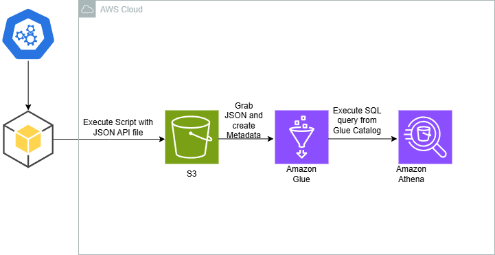

<p align="center">
  
  
## ☁️ 30 Days DevOps Challenge - Creating an AWS Glue Database with Sport Data using Amazon S3 and Amazon Athena.  ☁️

This is part of the third project in the 30-day DevOps challenge! 

In this project, I created an AWS Glue Database capable of quering data from RapidApi's sports data allowing me to show Team's stats as well as standings using amazon S3 and Amazon Athena.


<h2>Environments and Technologies Used</h2>

  - Python
  - Amazon Athena
  - Amazon Glue
  - S3
  - RapidAPI
  - Gitpod


  
<h2>Features</h2>  

🏟️ Sports Data Analytics (Like Premier League Soccer):

- Amazon S3: Store raw and processed data of soccer matches, teams, and statistics. 🏅
- Amazon Athena: Run quick SQL queries to analyze team performance and trends. 📊⚽
- Amazon Glue: Transform and prepare the data for analysis, making it easy to query and visualize. 🧹🔍


<h2>Step by Step Instructions</h2>

***1. Repo and API configuration***

We will begin by setting up the environment and code that we will be utilizing. In this instance, we will use gitpod to create a new workspace and do the commands from there. We will be setting up an account with RapidAPI for our Premier League Standings data.

I created a .yml script for gitpod where it will automatically install AWS CLI and set the AWS credentials with the environment variables defined in Gitpod. This makes sure that our future projects are automated and we can start right away.

To achieve this, we will go to Gitpod's settings and set our credentials with the variables `AWS_ACCESS_KEY_ID`, `AWS_SECRET_ACCESS_KEY` and `AWS_DEFAULT_REGION` Respectively.


Finally, we will make sure our dependencies are installed properly.

```
pip install boto3
pip install python-dotenv
pip install requests
```

***Option 2: Local AWS CLI Setup***

NOTE: Keep in mind this is for a Linux environment, check the AWS documentation to install it in your supported Os.

   ```
   curl "https://awscli.amazonaws.com/awscli-exe-linux-x86_64.zip" -o "awscliv2.zip"
unzip awscliv2.zip
sudo ./aws/install
```
We then do `AWS configure` and enter our access and secret key along with the region. Output format set to JSON. With this command we will double check that our credentials are put in place for CLI:

```
aws sts get-caller-identity
```


***2. Set up IAM Roles***

Next, we will be setting up the IAM roles necessary to execute all of our actions and functions through the command by giving permissions to access AWS Glue, S3 and Amazon Athena. 

We begin by creating the role specifying the json policy.

```
aws iam create-role --role-name SportsQuery --assume-role-policy-document '{
  "Version": "2012-10-17",
  "Statement": [
    {
      "Effect": "Allow",
      "Principal": {
        "Service": "lambda.amazonaws.com"
      },
      "Action": "sts:AssumeRole"
    }
  ]
}'
```

Then, we attach the permissions to the role.

```
aws iam put-role-policy --role-name SportsQuery --policy-name SportsQueryPermissions --policy-document '{
  "Version": "2012-10-17",
  "Statement": [
    {
      "Effect": "Allow",
      "Action": [
        "s3:CreateBucket",
        "s3:PutObject",
        "s3:DeleteBucket",
        "s3:ListBucket",
        "glue:CreateDatabase",
        "glue:CreateTable",
        "glue:DeleteDatabase",
        "glue:DeleteTable",
        "athena:StartQueryExecution",
        "athena:GetQueryResults"
      ],
      "Resource": "*"
    }
  ]
}'
```

Finally, we verify the role created along with the policies.

```
aws iam get-role --role-name SportsQuery
aws iam get-role-policy --role-name SportsQuery --policy-name SportsQueryPermissions
```


***3. Create .env file***

in the CLI, we will use `nano` to create and modify the .env file where we will store our API key and endpoint URL. 

```
SPORTS_DATA_API_KEY=your_sportsdata_api_key
NBA_ENDPOINT=https://api.sportsdata.io/v3/nba/scores/json/Players
```


***4. Set up our Python file and test***

In this step, we will be setting up our Python file. With this code, we will make it so that a JSON file gets uploaded to an S3 bucket, created in the same code, as well as the creation of an `AWS Glue` database with the JSON generated.


***6.  Running the Script - Final Result.***

Finally, we will run the script.


A S3 bucket will be created alongside our generated `Premier League` JSON data and results from Amazon Athena!


Note: In my script I also made it so that it would convert the data to .csv for use in PowerBI as it could also be easily used for data visualization.

<h2>Conclusion</h2>

In this project, I learned how you can leverage a Python script to grab API data, send a query to a database and parse it accordingly.
